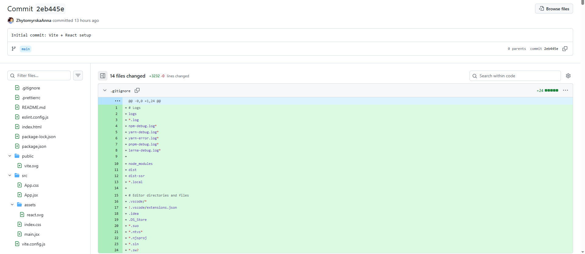
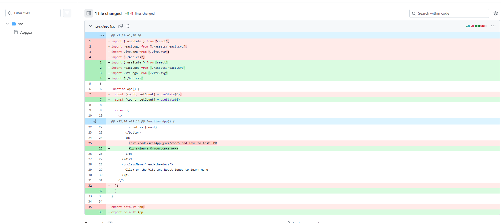
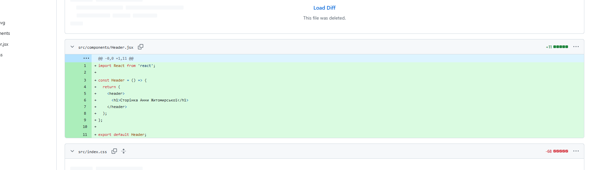
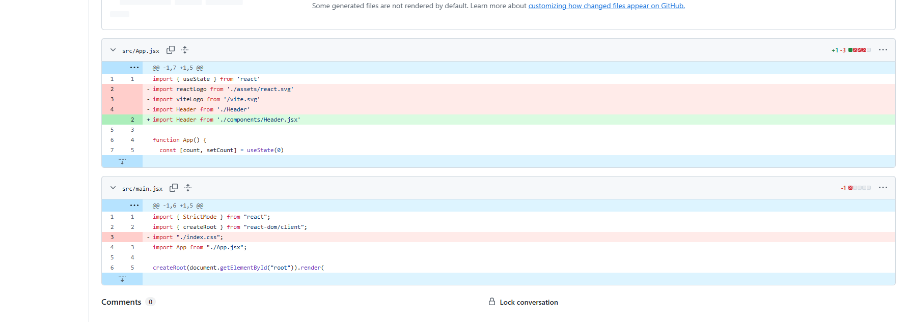

## Практична робота №1

**Тема:** Налаштування оточення та робота з Git

**Мета:** Навчитися створювати сучасні React-додатки за допомогою Vite, налаштовувати інструменти контролю якості коду (ESLint, Prettier) та відпрацювати базовий робочий процес (workflow) з гілками в Git.

