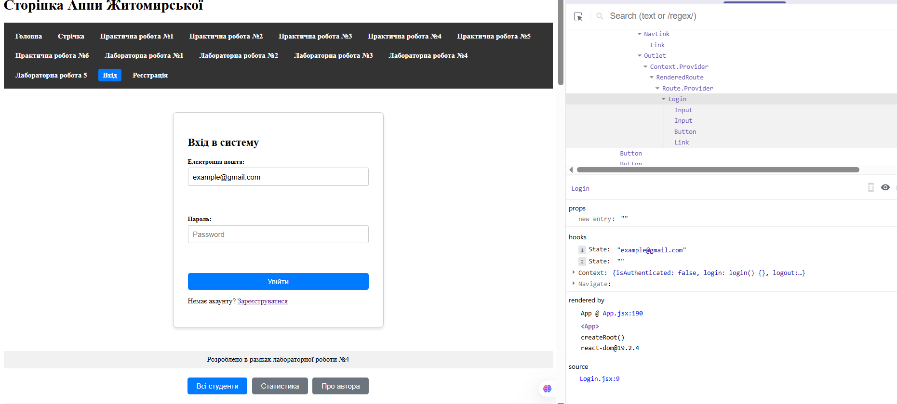
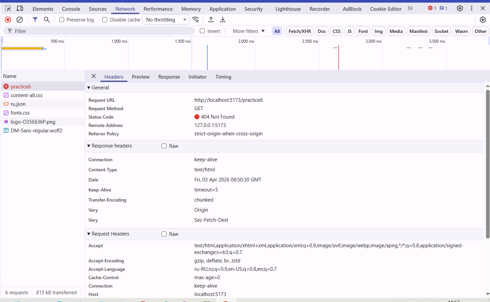
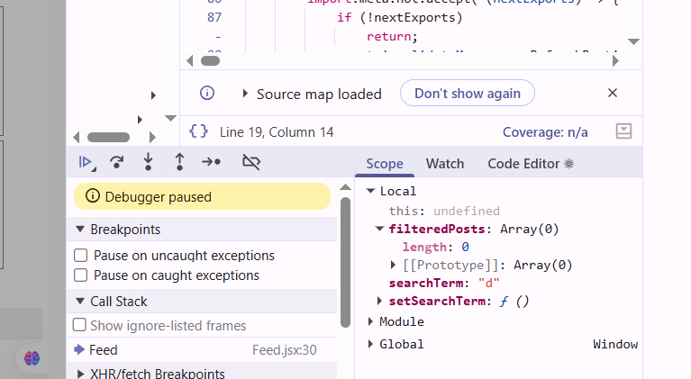

# Практична робота №6 

## У вашому єдиному репозиторії оберіть найбільш складний компонент, який працює зі станом (наприклад, `Profile.jsx` або форму логіну).За допомогою React DevTools (вкладка Components) знайдіть цей компонент, і вручну (натиснувши на значення у правій панелі розширення) змініть значення його State або Props "на льоту". Зафіксуйте, як миттєво відреагує UI.

## Викличте нескінченний цикл рендеру у вашому компоненті (наприклад, написавши `<button onClick={setLikes(likes + 1)}>` замість передачі функції), зловіть помилку _Too many re-renders_ і дослідіть стек виклику у консолі браузера.

``./Practice6/Post.jsx``
`` <button onClick={setLikes(likes + 1)}>Збільшити</button>``

## Додайте у функцію отримання даних (`useEffect` або обробник `onClick`) команду `debugger;`.

## Перезавантажте сторінку. Коли браузер зупиниться у панелі Sources, скористайтеся інструментами "Step Over" (F10) та "Step Into" (F11), щоб покроково пройтись логікою та дослідити панель "Scope" (Область видимості).
``./Practice6/Feed.jsx ``
`` 
    if (searchTerm.length > 0) {
    debugger; 
  }
``
[Step Over](image-7.png)
[Step Into](image-8.png)
## Контрольні запитання

**1. В чому полягає критична перевага використання React Developer Tools (Components) порівняно зі звичайним інспектуванням DOM-елементів (Elements) при пошуку помилок у React-додатку?**

Вкладка Elements показує лише фінальний HTML-код, у той час як React DevTools дозволяє бачити логічну структуру компонентів, їхні внутрішні стани (State) та передані параметри (Props). Це дає змогу розробнику зрозуміти, чому інтерфейс виглядає саме так, аналізуючи дані до того, як вони перетворилися на звичайні теги в браузері.

**2. Як відловити ситуацію, коли React виконує неоптимальний рендеринг списків через неправильне використання атрибута `key`?**

Для цього у налаштуваннях React DevTools слід увімкнути функцію "Highlight updates when components render". Після цього при будь-якій зміні на сторінці компоненти будуть підсвічуватися кольоровими рамками: якщо при оновленні одного елемента блимає весь список, це пряма ознака того, що React не може розрізнити елементи через некоректні ключі та перемальовує зайве.

**3. Поясніть алгоритм дій розробника при встановленні та використанні Breakpoint у вкладці Sources браузера Chrome. Що відбувається з виконанням програми в цей момент?**

Розробник відкриває файл у вкладці Sources (через Ctrl+P) і натискає на номер потрібного рядка, встановлюючи синій маркер. У момент, коли код доходить до цієї точки, виконання програми повністю «заморожується», дозволяючи розробнику детально вивчити значення всіх змінних у цей конкретний момент часу через панель Scope.

**4. Яке ключове слово (резервоване в JavaScript) можна написати безпосередньо у вихідному коді компонента, щоб змусити браузер автоматично зупинити виконання при відкритій панелі розробника?**

Для цього використовується зарезервоване слово debugger;. Якщо воно зустрічається в коді при відкритій панелі розробника, браузер ініціює зупинку на цьому рядку, що працює аналогічно до вручну поставленої точки зупинки (Breakpoint).

**5. Що означають дії "Step Over", "Step Into" та "Step Out" у панелі управління дебагером браузера (Sources)?**

Step Over (F10) дозволяє перейти до наступного рядка коду в поточному файлі, не заходячи всередину функцій, що викликаються. Step Into (F11) навпаки «занурює» розробника всередину функції на поточному рядку для детального вивчення її логіки. Step Out (Shift+F11) миттєво довиконує поточну функцію та повертає дебагер на рядок, з якого вона була викликана.